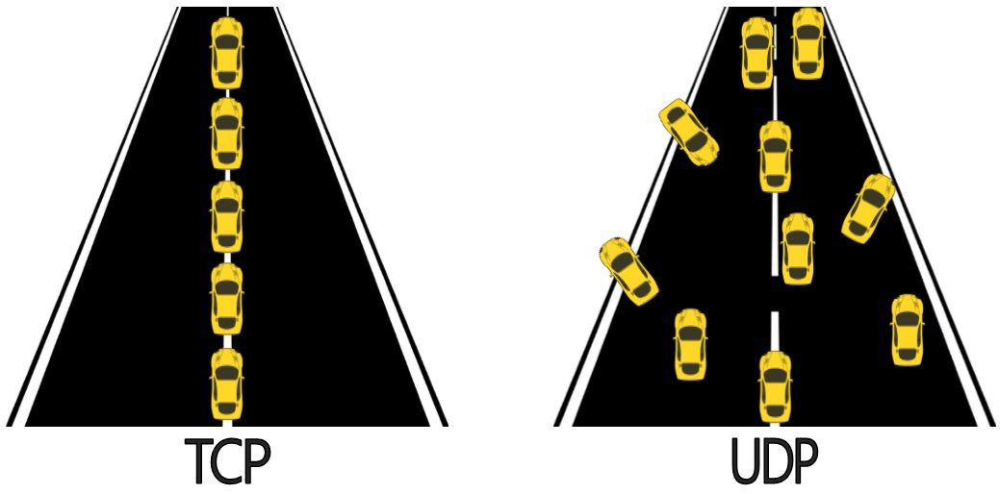
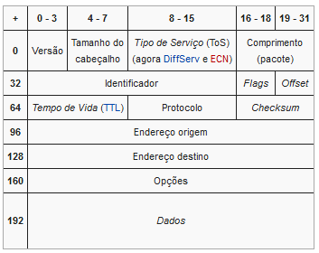

# CyberSecurity

## Roadmap

## OSI

O modelo OSI([Artigo](https://www.cloudflare.com/pt-br/learning/ddos/glossary/open-systems-interconnection-model-osi/), [Wikipedia](https://pt.wikipedia.org/wiki/Modelo_OSI) [Ted Talk])(https://www.youtube.com/embed/oz8gvGIUKFw?start=139&end=228) fornece um padrão para que diferentes sistemas de computadores possam se comunicar e pode ser visto como uma linguagem universal para redes de computadores. É baseado no conceito de dividir um sistema de comunicação em [sete camadas abstratas](https://www.cloudflare.com/pt-br/learning/ddos/glossary/open-systems-interconnection-model-osi/), empilhadas umas sobre as outras. 

## Redes

Rede é um conjunto de dois ou mais dispositivos eletrônicos de computação interligados por um sistema de comunicação digital, guiados por um conjunto de regras (protocolo de rede) para compartilhar entre si informação, serviços e, recursos físicos e lógicos.
### Camada de Rede

#### TCP

[Protocolo de Controle de Transmissão](https://pt.wikipedia.org/wiki/Transmission_Control_Protocol) é um dos protocolos de comunicação, da camada de transporte da rede de computadores do Modelo OSI, que dão suporte a rede global Internet, verificando se os dados são enviados na sequência correta e sem erros via rede. É complementado pelo protocolo da Internet, normalmente chamado de, [TCP/IP](https://www.youtube.com/embed/bH29oltn8Cw?start=10&end=139).

#### UDP

 Através da utilização [desse protocolo](https://www.alura.com.br/artigos/quais-as-diferencas-entre-o-tcp-e-o-udp), pode-se enviar datagramas de uma máquina à outra, mas sem garantia de que os dados enviados chegarão intactos e na ordem correta. Além do mais, o UDP é um protocolo que não é voltado à conexão.

 

#### IPV4

O [IPv4](https://www.youtube.com/embed/XPWd08tLAuo?start=16&end=137) é um protocolo sem conexão, para utilização de comutação de pacotes redes. Ele opera em um modelo de entrega por menor esforço, em que não garante a entrega, nem garante a sequência correta ou evita a duplicação de entrega. Estes aspectos, incluindo a integridade dos dados, são abordados por uma camada superior de protocolo de transporte, tais como o Protocolo de Controle de Transmissão (TCP).

O IPv4 utiliza endereços de 32 bits, o que limita o espaço de endereço para 4294967296 (232) endereços. Datagrama:

- IPV6

[IPv6](http://jkolb.com.br/protocolo-ip-ipv4-e-ipv6/) é a versão mais atual do Protocolo de Internet. Originalmente oficializada em 6 de junho de 2012, é fruto do esforço do IETF para criar a "nova geração do IP".

### Camada de Aplicação

#### DNS

Os servidores [DNS](https://www.youtube.com/embed/oukRwnVAamo?start=13&end=113) (Domain Name System, ou sistema de nomes de domínios) são os responsáveis por localizar e traduzir para números IP os endereços dos sites que digitamos nos navegadores.

Imagine ter que acessar seus sites preferidos através de números de [IP (Internet Protocol)](https://canaltech.com.br/internet/o-que-e-dns/), memorizando sequências de números para cada um deles. Conseguiríamos acessar meia dúzia deles no máximo, mais ou menos a mesma quantidade de números de telefone que conseguimos memorizar, não é?

#### WWW

[World Wide Web](https://www.tecmundo.com.br/web/759-o-que-e-world-wide-web-.htm), o famoso WWW, é um sistema de documentos dispostos na Internet que permitem o acesso às informações apresentadas no formato de hipertexto. Para ter acesso a tais informações pode-se usar um programa de computador chamado navegador.

#### HTTP / HTTPS

HTTP é um protocolo de transferência que possibilita que as pessoas que inserem a URL do seu site na Web possam ver os conteúdos e dados que nele existem. A sigla vem do inglês Hypertext Transfer Protocol.

O protocolo HTTP define um conjunto de métodos de requisição responsáveis por indicar a ação a ser executada para um dado recurso. Embora esses métodos possam ser descritos como substantivos, eles também são comumente referenciados como HTTP Verbs (Verbos HTTP).

#### Exemplo de requisição GET

    GET /hello.htm HTTP/1.1
    User-Agent: Mozilla/4.0 (compatible; MSIE5.01; Windows NT)
    Host: www.tutorialspoint.com
    Accept-Language: en-us
    Accept-Encoding: gzip, deflate
    Connection: Keep-Alive

#### Exemplo de requisição POST

    POST / HTTP/1.1
    Host: foo.com
    Content-Type: application/x-www-form-urlencoded
    Content-Length: 13

    say=Hi&to=Mom
    
### O que é o https ?

[HTTPS](https://www.alura.com.br/artigos/qual-e-diferenca-entre-http-e-https) (Hyper Text Transfer Protocol Secure - protocolo de transferência de hipertexto seguro) é uma implementação do protocolo HTTP sobre uma camada adicional de segurança que utiliza o protocolo SSL/TLS.

### Correio eletrônico

Um correio eletrônico ou correio eletrónico ou, ainda, e-mail, é um método que permite compor, enviar e receber mensagens através de sistemas eletrônicos de comunicação. O Correio Eletrônico é tipicamente um modo assíncrono de comunicação.O termo "e-mail" é aplicado tanto aos sistemas que utilizam a Internet e que são baseados nos protocolos [POP3](https://pt.wikipedia.org/wiki/Post_Office_Protocol), [IMAP](https://pt.wikipedia.org/wiki/Internet_Message_Access_Protocol) e [SMTP](https://pt.wikipedia.org/wiki/Simple_Mail_Transfer_Protocol), como àqueles sistemas conhecidos como intranets, que permitem a troca de mensagens dentro de uma empresa ou organização e que são, normalmente, baseados em protocolos proprietários.

## Servidor

Em informática, um servidor é um software ou computador, com sistema de computação centralizada que fornece serviços a uma rede de computadores, chamada de cliente.

### Hardware

Um servidor é um computador equipado com um ou mais processadores, bancos de memória, portas de comunicação e, ocasionalmente, algum sistema para armazenamento de dados como hard disks internos ou memórias SSD. É mais forte do que um desktop comum.

### Software

Servidor web é um software responsável por aceitar pedidos em HTTP de clientes, geralmente os navegadores, e servi-los com respostas em HTTP, incluindo opcionalmente dados, que geralmente são páginas web, tais como documentos em HTML com objetos embutidos (imagens, etc) ou um computador que executa um programa que provê a funcionalidade descrita anteriormente.O mais popular, e mais utilizado no mundo, é o servidor Apache (software livre). A Microsoft possui a sua própria solução denominada IIS (Internet Information Services).

## Aprendendo novas tecnologias

Conhecer bem as tecnologias da web é a base para protejer os sistemas de invasores.

### Cursos gratuitos

HTML => https://www.youtube.com/watch?v=epDCjksKMok&list=PLHz_AreHm4dlAnJ_jJtV29RFxnPHDuk9o

PHP => https://www.youtube.com/watch?v=R_yRrYUHai0&list=PLesCEcYj003TrV2MvUOnmVtMdgIp0C4Pd

Javascript => https://www.youtube.com/playlist?list=PLntvgXM11X6pi7mW0O4ZmfUI1xDSIbmTm

Python => https://www.youtube.com/watch?v=j94IGZmwtYI&list=PLesCEcYj003QxPQ4vTXkt22-E11aQvoVj

## Vulnerabilidades

### Como se informar sobre vulnerabilidades já descobertas por pesquisadores ?

#### O que é CVE ?

O [CVE](https://www.redhat.com/pt-br/topics/security/what-is-cve), sigla inglesa para Vulnerabilidades e Exposições Comuns, é uma lista pública de falhas de segurança. Quando alguém menciona um CVE, geralmente está se referindo ao número de identificação (ID) atribuído a uma falha de segurança.

[Procurar CVES](https://cve.mitre.org/)
- O que é exploit ?

Um [exploit](https://www.kaspersky.com.br/blog/exploits-problem-explanation/6010/) é um pedaço de software, um pedaço de dados ou uma sequência de comandos que tomam vantagem de um defeito, falha ou vulnerabilidade a fim de causar um comportamento acidental ou imprevisto a ocorrer no software ou hardware de um computador ou em algum eletrônico.

[Procurar exploits](https://www.exploit-db.com/)
## Hora de praticar !
### Algumas falhas comuns

#### Information disclosure

[A divulgação de informações](https://portswigger.net/web-security/information-disclosure), também conhecida como vazamento de informações, ocorre quando um site da Web revela, sem querer, informações confidenciais a seus usuários. Dependendo do contexto, os sites podem vazar todos os tipos de informações para um invasor potencial, incluindo:

- Dados sobre outros usuários, como nomes de usuário ou informações financeiras
- Dados comerciais ou empresariais confidenciais
- Detalhes técnicos sobre o site e sua infraestrutura

[Acesse o laboratório](https://portswigger.net/web-security/information-disclosure/exploiting/lab-infoleak-in-error-messages)

**Solução**

#### Business logic vulnerabilities

[Vulnerabilidades de lógica](https://portswigger.net/web-security/logic-flaws) de negócios são falhas no design e na implementação de um aplicativo que permitem que um invasor elicie um comportamento indesejado. Isso potencialmente permite que os invasores manipulem funcionalidades legítimas para atingir um objetivo malicioso. Essas falhas são geralmente o resultado da falha em antecipar os estados incomuns do aplicativo que podem ocorrer e, conseqüentemente, da falha em lidar com eles com segurança.

[Acesse o laboratório](https://portswigger.net/web-security/logic-flaws/examples/lab-logic-flaws-excessive-trust-in-client-side-controls)

**Solução**

#### Cross-site scripting

[Cross-site scripting](https://portswigger.net/web-security/cross-site-scripting) (também conhecido como XSS) é uma vulnerabilidade de segurança da Web que permite que um invasor comprometa as interações que os usuários têm com um aplicativo vulnerável. Ele permite que um invasor contorne a política de mesma origem, que é projetada para separar sites diferentes uns dos outros. As vulnerabilidades de script entre sites normalmente permitem que um invasor se disfarce de usuário vítima, execute quaisquer ações que o usuário seja capaz de realizar e acesse quaisquer dados do usuário. Se o usuário vítima tiver acesso privilegiado dentro do aplicativo, o invasor poderá obter controle total sobre todas as funcionalidades e dados do aplicativo.

[ Acesse o laboratório](https://portswigger.net/web-security/cross-site-scripting/reflected/lab-html-context-nothing-encoded)

**Solução**

#### SQL injection

[A injeção de SQL](https://portswigger.net/web-security/sql-injection) é uma vulnerabilidade de segurança da web que permite que um invasor interfira nas consultas que um aplicativo faz ao seu banco de dados. Geralmente, permite que um invasor visualize dados que normalmente não é capaz de recuperar. Isso pode incluir dados pertencentes a outros usuários ou quaisquer outros dados que o próprio aplicativo é capaz de acessar. Em muitos casos, um invasor pode modificar ou excluir esses dados, causando alterações persistentes no conteúdo ou comportamento do aplicativo.

[Acesse o laboratório](https://portswigger.net/web-security/sql-injection/lab-retrieve-hidden-data)

**Solução**

