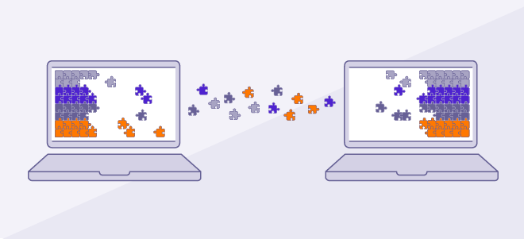
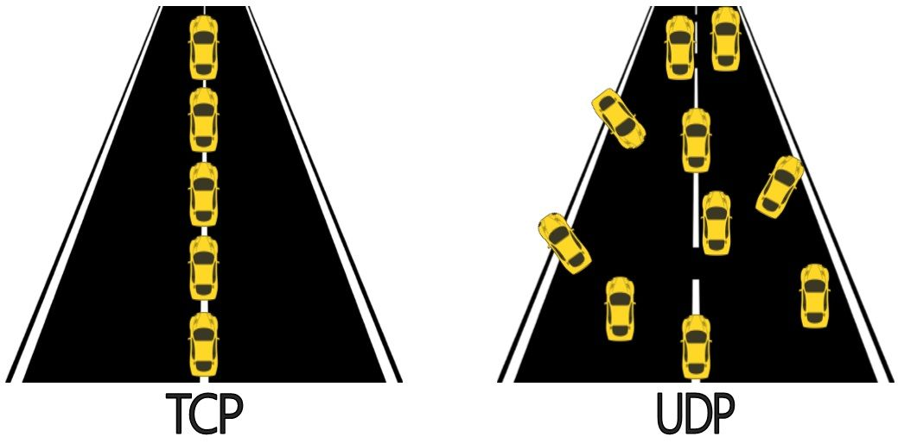

# Camada de Rede

- TCP

Protocolo de Controle de Transmissão é um dos protocolos de comunicação, da camada de transporte da rede de computadores do Modelo OSI, que dão suporte a rede global Internet, verificando se os dados são enviados na sequência correta e sem erros via rede. É complementado pelo protocolo da Internet, normalmente chamado de, TCP/IP.

[Ler mais](https://pt.wikipedia.org/wiki/Transmission_Control_Protocol)
ou
[Assistir um video](https://youtu.be/bH29oltn8Cw)

- UDP

 Através da utilização desse protocolo, pode-se enviar datagramas de uma máquina à outra, mas sem garantia de que os dados enviados chegarão intactos e na ordem correta. Além do mais, o UDP é um protocolo que não é voltado à conexão.

 

[[!] Sujestão de leitura](https://www.alura.com.br/artigos/quais-as-diferencas-entre-o-tcp-e-o-udp)

- IPV4

O IPv4 é um protocolo sem conexão, para utilização de comutação de pacotes redes. Ele opera em um modelo de entrega por menor esforço, em que não garante a entrega, nem garante a sequência correta ou evita a duplicação de entrega. Estes aspectos, incluindo a integridade dos dados, são abordados por uma camada superior de protocolo de transporte, tais como o Protocolo de Controle de Transmissão (TCP).

O IPv4 utiliza endereços de 32 bits, o que limita o espaço de endereço para 4294967296 (232) endereços.Datagrama:

[Ler mais](http://jkolb.com.br/protocolo-ip-ipv4-e-ipv6/)
ou
[Assistir um video](https://www.youtube.com/watch?v=XPWd08tLAuo)

- IPV6

IPv6 é a versão mais atual do Protocolo de Internet. Originalmente oficializada em 6 de junho de 2012, é fruto do esforço do IETF para criar a "nova geração do IP".

[Ler mais](http://jkolb.com.br/protocolo-ip-ipv4-e-ipv6/)
ou
[Assistir um video](https://www.youtube.com/watch?v=XPWd08tLAuo)
